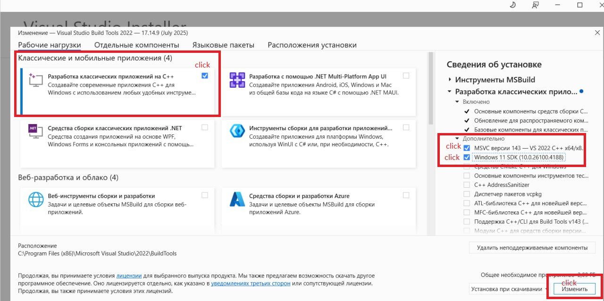

# 🌑 LuaJIT installer

## Windows 10+

### Prerequisites

This script is just an automated execution of the installation described here [luajit.org/install.html](https://luajit.org/install.html)

To build LuaJIT, you need _Microsoft Build Tools_. You probably have them. if not, then:

- Download _Microsoft Build Tools_ installer for example here [aka.ms/vs/17/release/vs_buildtools.exe](https://aka.ms/vs/17/release/vs_buildtools.exe)
- Run it
- Next, you need to select a list of tools that need to be installed, the minimum list is as follows:
    - C++ x64/x86 build tools
    - Windows SDK



### Installing

`win/luajit_installer.vbs` - installer

- Update the `download_link` (if needed) 
- Update the `archive_url` in the installer to point to the newest LuaJIT release (or stick with version 2.1 if you prefer)

```VB
' settings block start

archive_url = "https://github.com/LuaJIT/LuaJIT/archive/refs/tags/v2.1.ROLLING.zip"
download_dir_path = "C:/LuaJIT/" ' auto-created if missing

' settings block end
```

The script launches with just a double-click