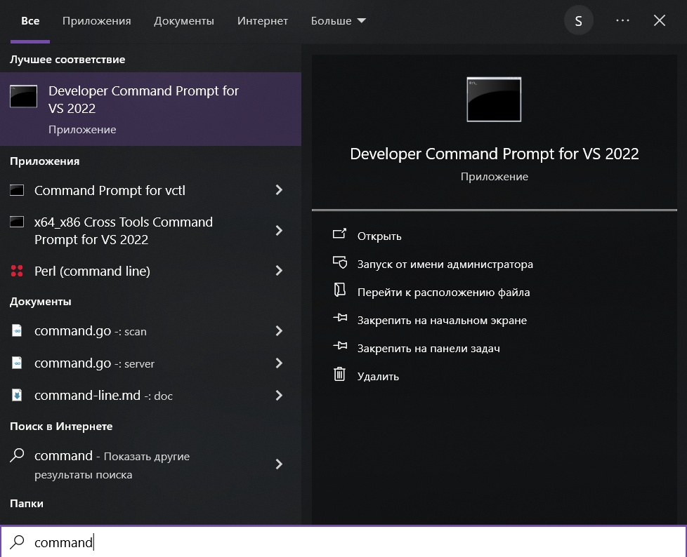

# 🌑 LuaJIT installer

## Windows 10+

===



To build the LuaJIT script, it uses Microsoft tools. If you don't have 'Command Prompt for VS', install Visual Studio Build Tools ([click to download](https://aka.ms/vs/17/release/vs_buildtools.exe)). The installer has a graphical interface - just click 'Install'.

===

`win/luajit_installer.vbs` - installer

- Update the `download_link` (if needed) 
- Update the `archive_url` in the installer to point to the newest LuaJIT release (or stick with version 2.1 if you prefer)

```VB
' settings block start

archive_url = "https://github.com/LuaJIT/LuaJIT/archive/refs/tags/v2.1.ROLLING.zip"
download_dir = "C:/LuaJIT/" ' auto-created if missing

' settings block end
```

The script launches with just a double-click